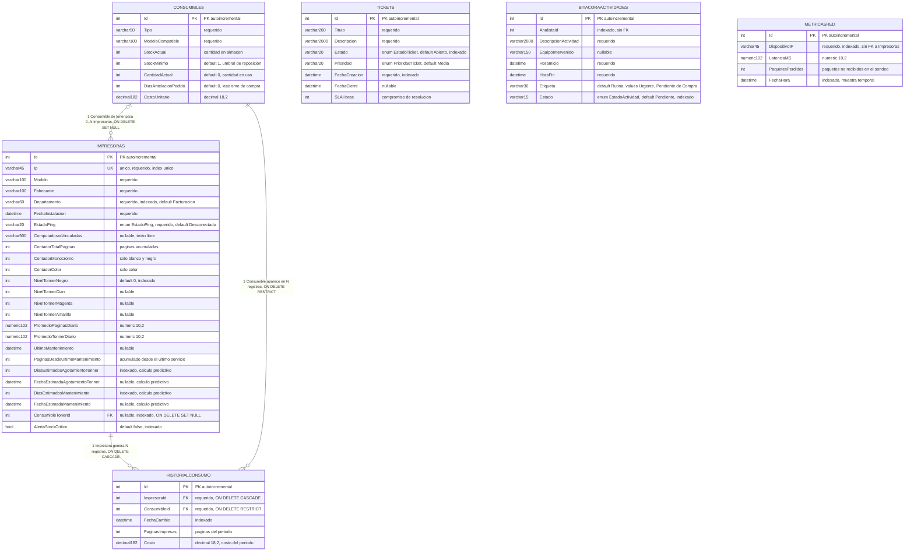

# Diagrama de Arquitectura de Datos - SGCTI

Sistema de Control de Suministros y Gestión de los Servicios TI.

**Fuente:** `src/Sgcti.Infrastructure/Persistence/SgctiDbContext.cs` (configuración en
`OnModelCreating`) y las entidades de `src/Sgcti.Core/Entities/`.

**Sintaxis:** `erDiagram` de Mermaid.js, validada con el parser de Mermaid v12
(6 entidades, 3 relaciones, 60 atributos).

> Los comentarios `%%` no están soportados dentro de `erDiagram` en Mermaid: rompen el
> parseo. Por eso las notas van en las etiquetas de atributos y en las secciones de este
> documento, no como comentarios del diagrama.

## Diagrama Entidad-Relación

## Relationships

| # | Origen | Cardinalidad | Destino | FK | Comportamiento al borrar |
|---|--------|--------------|---------|----|--------------------------|
| 1 | `IMPRESORAS` | 1 → N (obligatoria) | `HISTORIALCONSUMO` | `ImpresoraId` | `Cascade` |
| 2 | `CONSUMIBLES` | 1 → N (obligatoria) | `HISTORIALCONSUMO` | `ConsumibleId` | `Restrict` |
| 3 | `CONSUMIBLES` | 0..1 → N (opcional) | `IMPRESORAS` | `ConsumibleTonerId` | `SetNull` |

`HISTORIALCONSUMO` es una entidad asociativa que resuelve la relación muchos-a-muchos
entre `Impresoras` y `Consumibles`, guardando además los datos del periodo
(`PaginasImpresas`, `Costo`, `FechaCambio`).

## Enumeraciones

| Tipo | Valores | Se persiste como |
|------|---------|------------------|
| `EstadoPing` | `EnLinea`, `Inestable`, `Desconectado` | `string` (max 20) |
| `EstadoTicket` | `Abierto`, `EnProgreso`, `Resuelto` | `string` (max 20) |
| `PrioridadTicket` | `Baja`, `Media`, `Alta`, `Critica` | `string` (max 20) |
| `EstadoActividad` | `Pendiente`, `Completado` | `string` (max 15) |

Todas se configuran con `HasConversion<string>()`, por lo que las consultas que filtren
o ordenen por estos campos deben comparar contra el texto, no contra el enum.

## Hallazgos

Solo 3 de las 6 entidades tienen llaves foráneas reales. El resto del modelo es
plano y no participa en relaciones.

- **Tablas huérfanas:** `Tickets`, `BitacoraActividades` y `MetricasRed` no tienen
  ninguna relación configurada en `OnModelCreating`.
- **`BitacoraActividad.AnalistaId`** está indexado (`SgctiDbContext.cs:101`) pero no
  existe una entidad `Usuario`/`Analista` ni una propiedad de navegación. Es un enlace
  lógico a un modelo de usuarios que aún no está implementado.
- **`MetricaRed.DispositivoIP`** se indexa del mismo modo, pero nunca referencia
  `Impresoras.Ip`, pese a que ambas columnas se describen como la misma dirección de
  red y tienen el mismo largo (`varchar(45)`).
- **Relación unidireccional:** `Impresora.ConsumibleToner` se declara con `WithMany()`
  sin colección inversa (`SgctiDbContext.cs:49`), así que el lado `Consumible` no puede
  navegar hacia sus impresoras. Para consultas inversas hay que ir por `ConsumibleTonerId`.
- **Columnas potencialmente duplicadas:** `Consumible` declara `StockActual` y
  `CantidadActual` con significados solapados; solo `StockMinimo` recibe valor por
  defecto, y ninguna de las dos se valida en el modelo.
- **Desviación respecto a la especificación:** `spec/spec.md:78` describe
  `Tickets (ID, UsuarioSolicitante, Departamento, Categoria, Descripcion, Prioridad,
  Estado, FechaApertura, FechaCierre)`. Las columnas `UsuarioSolicitante`, `Departamento`,
  `Categoria` y `FechaApertura` **no existen** en la entidad real, que usa
  `FechaCreacion` y `Titulo`. Este diagrama refleja el código, que es la fuente de verdad.

## Índices

| Tabla | Columna(s) | Único |
|-------|-----------|-------|
| `Impresoras` | `Ip` | Sí |
| `Impresoras` | `Departamento`, `NivelTonnerNegro`, `DiasEstimadosAgotamientoTonner`, `DiasEstimadosMantenimiento`, `ConsumibleTonerId`, `AlertaStockCritico` | No |
| `HistorialConsumo` | `FechaCambio` | No |
| `Tickets` | `FechaCreacion`, `Estado` | No |
| `BitacoraActividades` | `Estado`, `AnalistaId` | No |
| `MetricasRed` | `FechaHora`, `DispositivoIP` | No |
